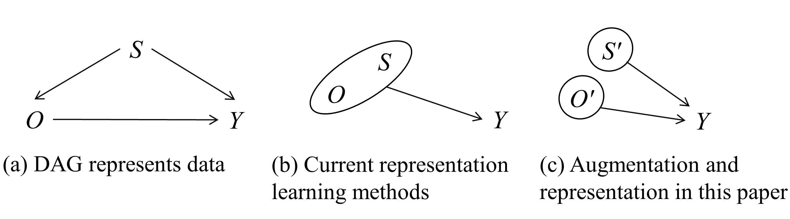
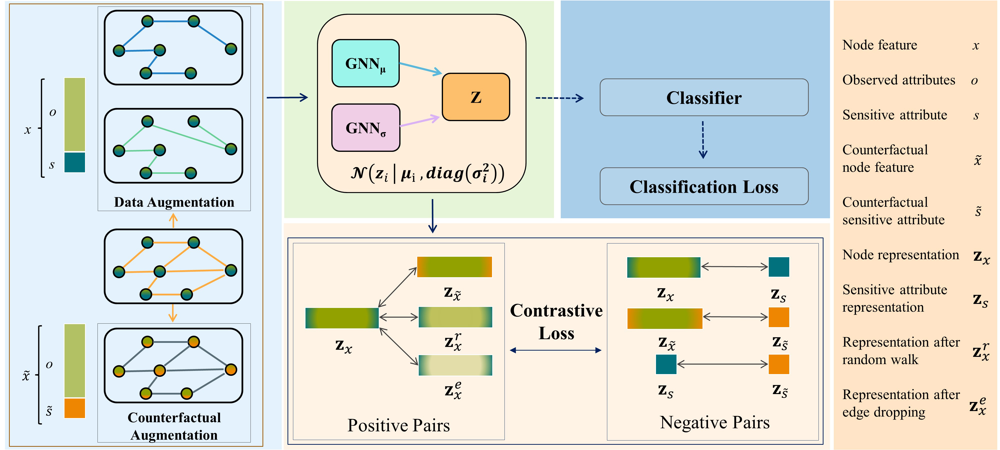

# FDGNN
This repository is an official PyTorch (Geometric) implementation of FDGNN in "Disentangled contrastive learning for fair graph representations".

**If you use this software, please consider citing:**
```linux
@article{zhang2025disentangled,
  title={Disentangled contrastive learning for fair graph representations},
  author={Zhang, Guixian and Yuan, Guan and Cheng, Debo and Liu, Lin and Li, Jiuyong and Zhang, Shichao},
  journal={Neural Networks},
  volume={181},
  pages={106781},
  year={2025},
  publisher={Elsevier}
}
```

## Motivation
Fair representation learning aims to acquire representations that accurately model the target variable while remaining insensitive to sensitive attributes. For example, fair representation assists in predicting recidivism rates without regard to age or gender. We use three causal DAG (directed acyclic graph) in Fig. to illustrate the motivation behind our proposal. In Fig. (a), the causal DAG represents data studied in this work, where variables O, S, and Y are interdependent. In Fig. (b),  the causal DAG denotes that existing GNN models utilize the entire set of attributes (O, S) to learn a fair node representation, potentially incorporating sensitive attribute information. In Fig. (c), the causal DAG denotes our proposed solution for learning fair node representations using augmentations and disentangling representation learning to separate sensitive information from others for building fair models.



The sensitive attributes S result in discrimination bias when using all attributes (O, S) to predict the target Y in the GNN model. To obtain a fair node representation, it is important to remove the effect of S on O. In this work, we use the idea of matching strategy, which is a well-known method in causal inference for removing confounding bias, to remove the influence of sensitive attributes on the non-sensitive attributes in fair node representation learning. 

## Framework
To achieve this goal, we propose a novel approach called Fair Disentangled Graph Neural Network (FDGNN) to achieve fair node representation in GNN models. First, FDGNN creates instances possessing identical attributes but distinct adjacency matrices through data augmentation and generates counterfactual instances to introduce perturbations to the sensitive attributes of instance nodes and their adjacent counterparts. Then, FDGNN enhances the representation of O while concurrently separating the representation of S within both the constructed and counterfactual instances, utilizing a disentangled contrastive learning method (i.e. the matching strategy). Additionally, FDGNN incorporates degree information of edges to capture the graph's structure and distinguish nodes. 




## Configuration
Please install python version 3.8.16, pytorch 1.10 + cu113 in the first place.
Then please install all necessary python packages via:
```linux
pip install -r requirements.txt
```
Please exclusively install the torch-geometric following [instructions](https://pytorch-geometric.readthedocs.io/en/latest/install/installation.html).

Note that for different datasets, you will need to adjust "MAX_LOGSTD" in ‘VGAE.py’.

## Result

Please reserve at least 40GB of memory on the GPU.

Here we provide shortcut actions to run FDGNN:

```linux
bash run_german.sh
```

[//]: # (```linux)

[//]: # (bash run_credit.sh)

[//]: # (```)

[//]: # ()
[//]: # (```linux)

[//]: # (bash run_recidivism.sh)

[//]: # (```)
